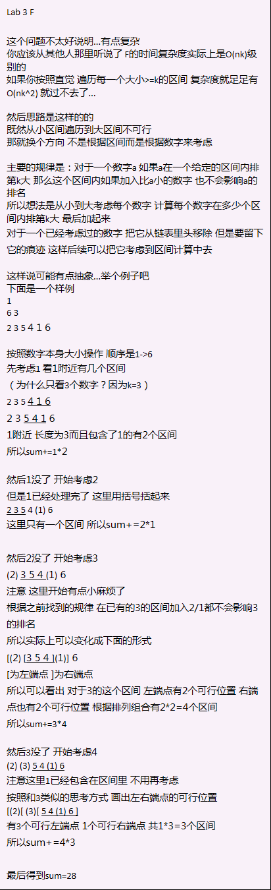

# Lab 3 链表

## A

有序链表合并 双指针法

## B

多项式相加... 基本上就是A的改版 不过注意多项式输出的坑...

可能的坑包括常数项、系数为1和-1的处理、结果为0的输出

## C

题目写的有点晦涩

重点：有书的拿书看，进来发现没书就直接走了

可以直接用开一个26大小的数组 记录每个人的状态

简单题

## D

多项式求导 直接在每个节点上进行操作 或者也可以重新开一个

输出部分可以直接在B的基础上修改

算法实现的时候要注意和B的不同：存在负指数项、存在相同指数项、输入不是按照指数排序的 需要自己排序

## E

约瑟夫环问题

解法1：直接上环状链表模拟 反正数据量才100

解法2：公式递推：每次一个人退出后 剩下的人在重新编号之后又组成了一个大小为n-1的子问题

列出公式：$$ f[1]=0; f[i]=(f[i-1]+m) \mod  i  (i>1) $$

m 每次数的人数 f[i] 第i轮获胜者在当前轮的编号#

## F

题目比C还难懂：统计每个大小>=k的区间中第k大的数的和

解法见下图

（credit: 李hn老师 姚yz老师）

## G

动态区间中位数问题

加强版本：数据流中位数

可以用大小堆/对顶堆 也可以用数组+链表的实现

用数组按照输入顺序存储 链表按照实际大小顺序存储 每次删掉数组最后的两个 根据删掉数字和中位数的相对大小来决定中位数指针的移动方向