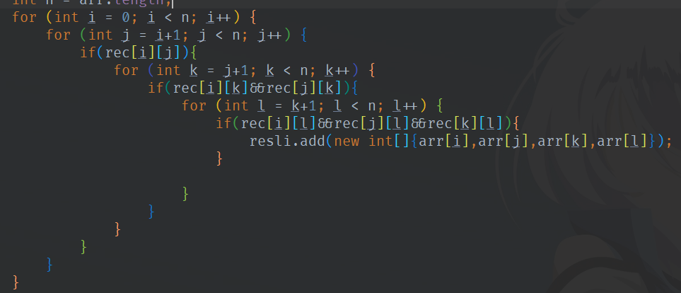

# Lab 8 图

## A

直接写 没坑

 

## B

广度优先

注意每次搜索完成需要把marker重置一下

 

## C

广度优先

因为一开始就指定了起点

可以参考6G的做法

从这个起点开始BST写入深度（距离）

坑：在顺序遍历的情况下 ArrayList 比 LinkedList 快  大概是内部有某种神奇的优化机制？

 

## D

这题用邻接矩阵就显著的比邻接表效果好

本质还是暴力

写一个四层循环来计算Cn4

注意 应该在循环中就判断连通性 这样可以跳过不必要的循环

（同理 也不能直接上排列组合 因为会有很多不需要计算的情况被重复计算了 例子： 1 2不连通 那么含有12的全部组合C73 2就都不可用了）

 

## E

单纯暴力

每次从一个新的坐标开始涂色

记录总共的涂色次数

然后找到下一个可以涂色的坐标

 

## F

有向无环图DAG找最长路径问题

原来的思路类似于6G 但是发现不适用 因为有方向限定 且可能存在相同起终点的多条路径

搜索之后 实际上是两部分：拓扑排序+动态规划

拓扑排序实际上是把图展开成一个有序列表 按照到起始点的距离从近到远

（起始点：入度为0的点，可能有多个）

具体方法是每次选一个入度为0的点放入已排序的列表 然后所有该点指向的点的入度减1 再找下一个入度为0的点

参考：https://blog.csdn.net/revivedsun/article/details/51286777

 

然后就是动态规划 原理是找到每个节点到起始点的最大可能距离

关联式：起点-当前点max_dist = max{起点-当前点max_dist, 起点-前一点max_dist + 前一点-当前点dist}

即对u的每个邻接点v （u是当前点 v是当前点的出边指向的点） 

 if (dist[v] < dist[u] + weight(u, v)) ………………………dist[v] = dist[u] + weight(u, v) 

最后取max / 最后一个就好了

 

另外的方法：

DFS到底 然后往回加距离

（注意初始化-1标记已经计算过）

 

用Dijkstra：权重全部改成负数

 

多个入度为0的点：建立虚拟原点

 

拓扑排序删不下去：有环

拓扑排序结果不唯一：如果遇到多个入度为0的点 可以随便选一个


```
测试样例
1
3 4
1 2 5
2 3 4
1 3 10
1 3 20

1
8 8
1 2 4
2 4 0
4 5 2
1 3 1
3 6 2
6 4 3
6 7 10
2 6 10
```


## G

树上：找一个节点是否是另一个节点的父节点

这个题目直接向上查找会T（还不是爆栈…估计有很奇妙的数据…）

修改尝试：利用树遍历的特性

参考：https://stackoverflow.com/questions/10310809/check-if-2-tree-nodes-are-related-ancestor-descendant-in-o1-with-pre-process

解释：如果一个节点是另一个节点的父节点 那么在前序遍历的时候在前 后序遍历的时候在后 所以可以通过记录遍历顺序并比较来判断

坑：相等！（自己是自己的父亲）

实现：我的实现就是把二叉树的遍历推广到一般的树上

为此前序遍历需要记录一个visno（下一个要去的子节点）

后序遍历需要实现一个反向的iterator来加入节点

然后就上个快读 就可以很极限的过了

 

其他解法：最近公共祖先 LCA

查看y是不是x的最近公共祖先即可

 

```
测试样例

1
8 3
2 1
3 1
4 1
6 2
5 2
7 3
8 4
6 2
6 3
8 1

YNY
```


## H

参考 HDU 6166

基础知识：Dijkstra算法可以计算两个集合之间的最短路

（实现修正：最小堆优化的时候比较堆内部和dis[n]的值 如果外面的比堆内部的小 那么堆内部的是旧的元素 应该舍弃掉接着从堆内部取值）

方法：一个集合中加一个起点 连到该集合的所有点 且权值为0

另一个集合中加一个终点 连到该集合的所有点 且权值为0

然后求从起点开始Dijkstra 最后得到的到终点的距离就是集合间的最短路程

 

但是这个题里有k个点 如果对每个点都跑最短路算法会TLE

一个很聪明的想法是二进制划分

思想：因为每个点的编号转换成二进制都不同

每个点之间至少会有一个二进制位不同

因此 可以考虑根据某个二进制位上是0还是1来作为划分的标准

把最后含有k个点的待求集合转换成log k个划分

然后对于每个划分 第i位上是0/1的分别作为一个集合

两个集合之间用之前的思想求最短路 最后全局取一个min就好了

 

建图超时：权值为1 不需要edge weight 因此可以修改结构

最后快读上了之后 5500 有点极限

 

注：交流后得到其实这个题目并不需要Dijkstra

因为这个题目中并没有给边附上权值 所以可以BFS

如果硬上Dijkstra会多logV复杂度

 

补充：BFS做法 （利用队列）

为什么可以：这是一个无权重的图

思路：如果只有两个点 左右两个点同时bfs 什么时候相遇就肯定是最短

在这里就集合中的k个点同时开始 什么时候有任意两个相遇 那就肯定可以了

（必须要两个不同起点相遇！[用颜色标记]）

```
测试样例
预期输出：1 2

1
13 15 9
1 2
2 4
3 4
3 5
5 6
6 7
4 8
5 8
8 9
9 7
7 10
9 12
10 11
12 11
11 13
1 2 3 4 10 11 12 13 9


1
11 11 4
1 3
2 3
3 4
4 5
5 11
4 6
6 7
7 8
8 9
9 10
5 9
1 2 10 11
```


## I

总算过了…真不容易

题意：计算所有点对的最小割之和

先说思路吧

1.找到图上所有的环

2.对每个环 找到环上最小的一条边 把它删掉 并把它的权值加到剩下的环边中

3.对新的权值排序

4.按照权值从大到小 放入新图 用并查集维护联通关系 增加ans

参考题目：HDU 6350 Always Online

为什么这样做是对的？本质上来说 这个做法是计算了各个节点的贡献

**贺老师课件：对于多个点对 很有可能都是由于一个共同的边决定是否联通 所以应该反过来 计算每条边对于全图的贡献**

 

实现上 主要也是这几步骤 找环 删边 重建

1 找环：思路是DFS 但是不能直接上tarjan 因为tarjan是针对有向图的点的 但是我们这里需要的是环边 但是基本上思维是类似的

最重要的思想：这个节点的所有边都访问过之后再弹出栈

这里我的做法是双栈：节点栈和边栈 遍历的时候两边一起进入 遇到边的另外一个端点在节点栈内的时候就说明找到了环

然后用先用反向Iterator一路把这个环上的边加到列表中 把这个环找完

再开始一个个节点出栈 直到某个节点还有其他边可以访问

最后节点栈空掉了 就完成整个图的遍历

需要注意随时判断要不要跳到下一个点(visno>=size)/下一条边(visited)

[小技巧：边存了一个sum 这样可以不用区分from和to 而是可以通过当前节点算出另一个端点的值]

 

2 删边：没什么好说的 就是找最小值 然后其他边加上 最后这个边disable掉就好了

 

3 重建：这里的麻烦主要是并查集的使用 因为我是第一次实现…

并查集本身并不困难 主要是这里涉及了两个相对麻烦的特性：路径压缩和size

因为每次增加ans的时候 需要计算新加入的边的两侧最多可联通多少个节点

所以对并查集的每个节点 需要保持一个size属性 表示自己和自己下边节点的个数和

每次加边的时候 需要从当前一侧的节点一直查询到最上层 用最上层的size作为这一侧联通的节点个数 然后ans+=左侧联通点数*右侧联通点数*当前边权重 作为当前这条边的贡献

路径压缩 则是通过记录查询时的路径 然后把查询路径上的节点全部指向最顶层节点的操作 这样可以减少深度 提高查询效率

这两个分开都没啥问题  关键是 如果存在size属性 在进行路径压缩的时候就需要进行一下处理 **每一层压缩都需要更新当前层父节点的size** 才能保证合并完之后所有节点的size都是正确的 [这就是我调了2天的bug]

 

然后总结下这个题目的坑吧

1 数据范围：光weight就1e9了 不仅ans需要用long 中间计算的时候也需要小心处理 最好全部都先切换到long再计算乘法

2 快读：新版本快读相对旧版有巨大速度提升 但是新版本没有快写 一个相对好的方案可能是新快读+旧快写

3 ArrayList扩容MLE：ArrayList每次是50%扩容 然后我就被坑到了MLE

如果不是很要求访问速度 而且每次确定是顺序访问的话 还是LinkedList比较保险一点

4 关于debug：和上次的情况类似 这次又是样例都对但是WA 一般这种情况都是自己算法出了问题 不用浪费时间去调整快读的参数

这次主要是通过改变边的输入顺序 才发现了结果的不稳定 进一步debug才确定了问题（因为路径压缩实际上效果太好了 然后bug在level>=3才会出现 所以之前小的样例都出现不了）

碎碎念：之前怀疑是并查集出问题 但是还是在找环的重写上费了很多时间… 手抖还是硬伤…哎…

以后遇到这种情况可能还是考虑直接重构…

```
测试样例
I 数据
2
10 12
1 2 1
1 3 1
2 4 1
2 7 1
3 7 1
3 10 1
4 5 1
4 6 1
7 8 1
7 9 1
5 6 1
8 9 2
13 17
1 2 1
1 3 1
13 3 1
13 10 1
2 4 1
2 7 1
3 7 1
3 10 1
4 5 1
4 6 1
5 6 1
7 8 1
9 8 1
9 7 1
10 12 1
11 12 1
11 10 1

A：64， 126


------------
4
3 2 
1 2 1
2 3 1

11 10
1 2 2
1 3 6
2 4 1
2 5 3
2 6 5
5 9 20
5 8 7
7 3 9
10 7 11
7 11 4


10 12
1 2 3
1 3 6
2 4 2
2 7 33
3 7 4
3 10 5
4 5 9
4 6 7
7 8 2
7 9 15
5 6 26
8 9 1

21 26
1 2 12
1 3 16
11 3 2
10 11 55
12 10 62
12 13 13
2 4 17
2 7 19
10 14 23
13 14 4
4 5 5
7 6 8
5 6 6
6 8 39
6 9 27
8 9 108
14 15 55
14 16 89
16 17 24
16 18 76
20 21 11
17 21 4
2 3 55
3 10 3
18 19 8
19 20 2

A：3 180 269 2828
```

