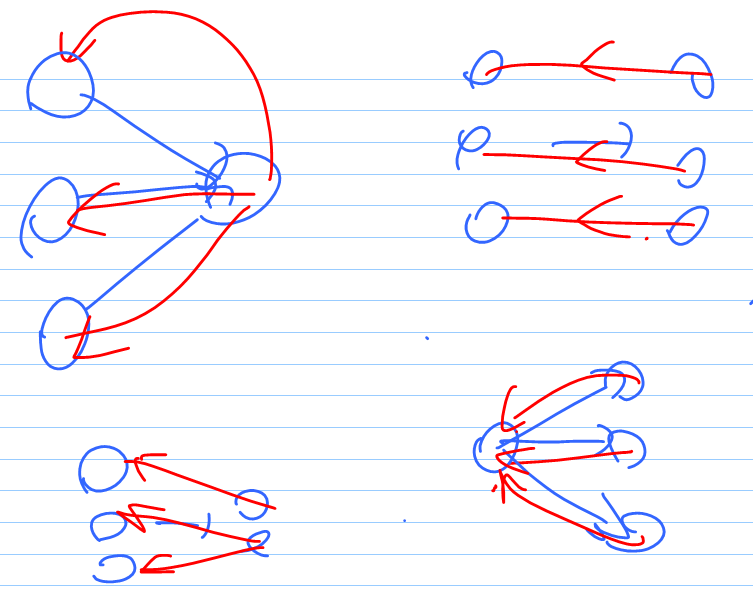

Lab 9 图2

 

# A

不知道什么情况…直接写就行了..

直接坐标绝对值相减

 

# B

虽然有很奇怪的限制条件 本质上就是最小生成树

但是不知道怎么回事 我的prim一直WA 但是kruskal就可以过

证明一般的最小生成树符合要求：考虑用kruskal的方式构建最小生成树

因为是从小到大挑选边加入 所以必然符合最大的边权值最小

 

# C

这里比上一题稍微修改了下 要求最小的边的权值最大

kruskal的话思路就比较直接 就是二分

先把所有边按照权值从小到大排序

需要二分的值是最小的边的权值 二分的标准是能否生成最小生成树（能否连接上所有点）

这样最后二分得到的就是最大的开始的边的id

但是仅仅二分还不够 因为这实际上是个多重排序问题

条件1： 最小权值 从大到小排序

条件2： 总成本 从小到大排序

所以从二分得到的最大开始id往下减id 每次都计算一次 添加到一个pq中

然后减到最大开始id的边的权值变小的时候就停止

最后选择排序完成的第一个就好了

 

# D

本质上是个最小生成树裸题

但是直接上会有坑 需要dfs/dijk先检查一下连通性

如果一开始给出的边都没法让图全联通 就不行

 

# E

选课系统就是拓扑排序的例子.. 但是拓扑排序的结果是不唯一的

因此在用pq的时候需要调整下构造器 先按照incount排序 再按照nodeid排序 nodeid小的在先

 

# F

分别从Alice和Bob两人出发 跑两边dijk

然后计算每个城市的max{a[i],b[i]} 选最小的就好了

 

# G

暴力（1<=k<=5）

从开始点和结束点跑dijk

内部节点考虑所有可能顺序

然后相加 得到每种经过顺序的总路程

最后选一个最小的

 

# H

黑洞作为节点 开始点/结束点也是节点

注意黑洞之间的边的距离需要做一下处理 把两个端点上的r剪掉

一个小坑：黑洞之间可能重叠 注意处理距离为负值

剩下精确度：内部全部double 最后输出的时候转long 用math.round

 

# I

暴力 （1<=m<=8）

考虑所有可能的选择方式：二进制

对每个选择 开启对应的集合内的边 然后跑kruskal

注：事实上似乎暴力的复杂度不太对劲 其他语言可能过不去

优化：对每个集合提前建好并查集 到时候一起加

 

# J 

HDU 6370

找狼人：1 一系列连续的村民边 最后出现了一条狼人边 构成了一个环

2 一个说确定的狼人是村民的人

找环：可以用dfs+栈找 也可以用并查集找

并查集找环：先所有村民边两端加入并查集 然后检查狼人边的两端是否在同一个并查集中

[为什么能用并查集？因为这里的出度为1]

找完1中狼人之后 还要反向dfs来找2中的狼人

 

注：lab修正

可以先完全用村民边建立图 然后？？

 

# K

SCC裸题

先手推一下 最后可以得出结论 最优情况应该是合并两个最大（节点个数最多）的SCC

然后就tarjan找SCC就好了

 

# L

HDU 2767

依然是SCC 

先跑tarjan 得到所有SCC

然后把SCC缩点 就能把原来的图转换成一个DAG

然后看所有节点的入度和出度 统计in=0, out=0的节点的个数

（如果完全游离 in=out=0 就两边都算上）

最后输出两者的最大值

为什么这样是对的？画个图….每次要把所有的右侧节点连回左侧

 